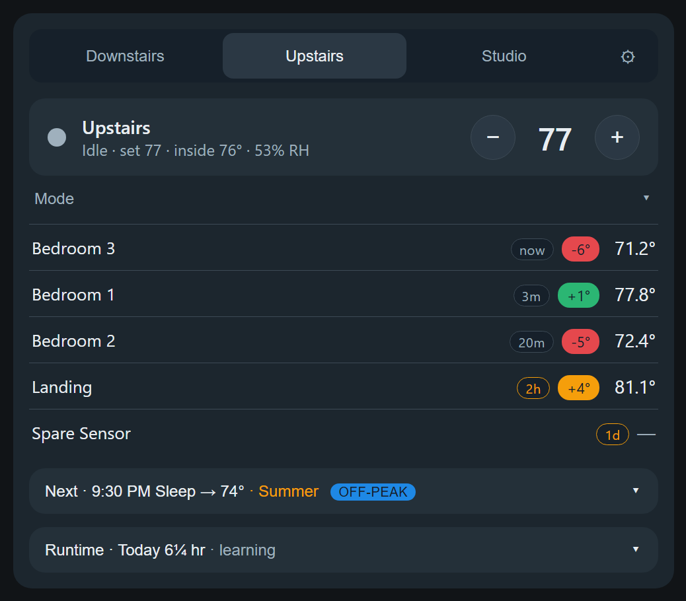
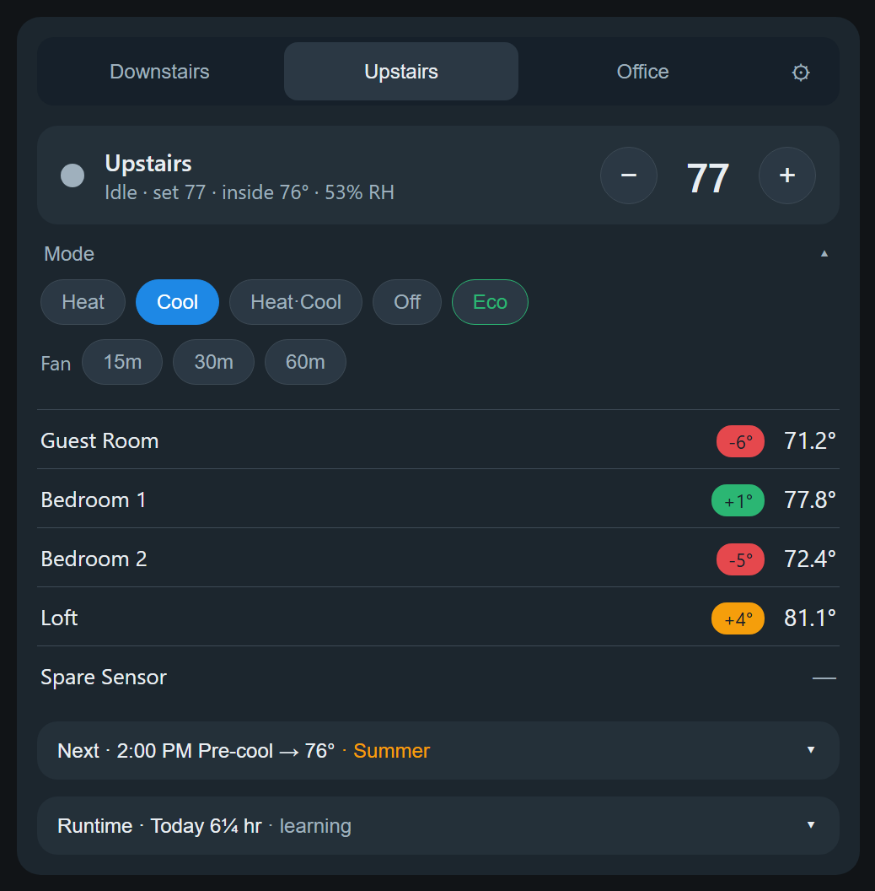
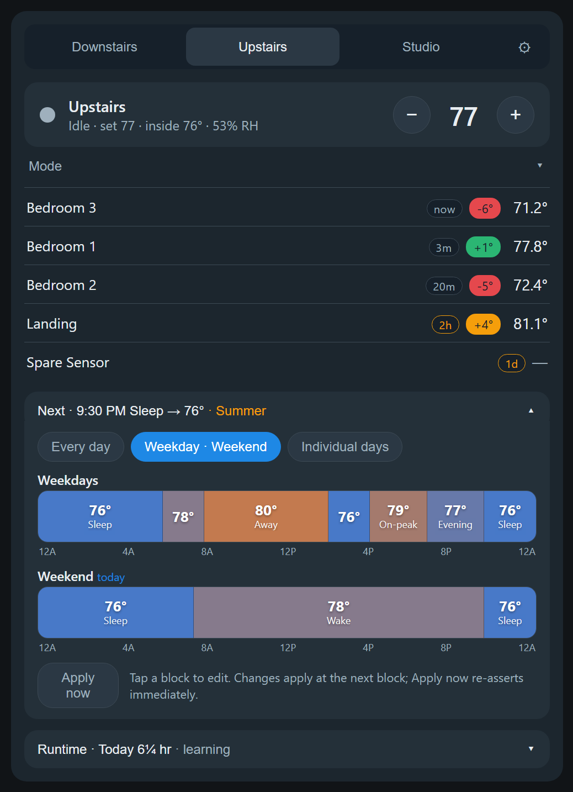
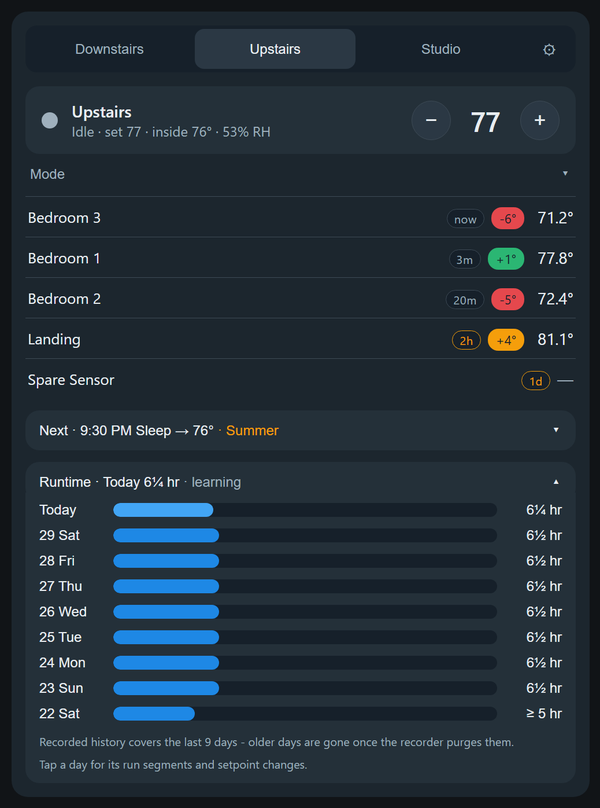
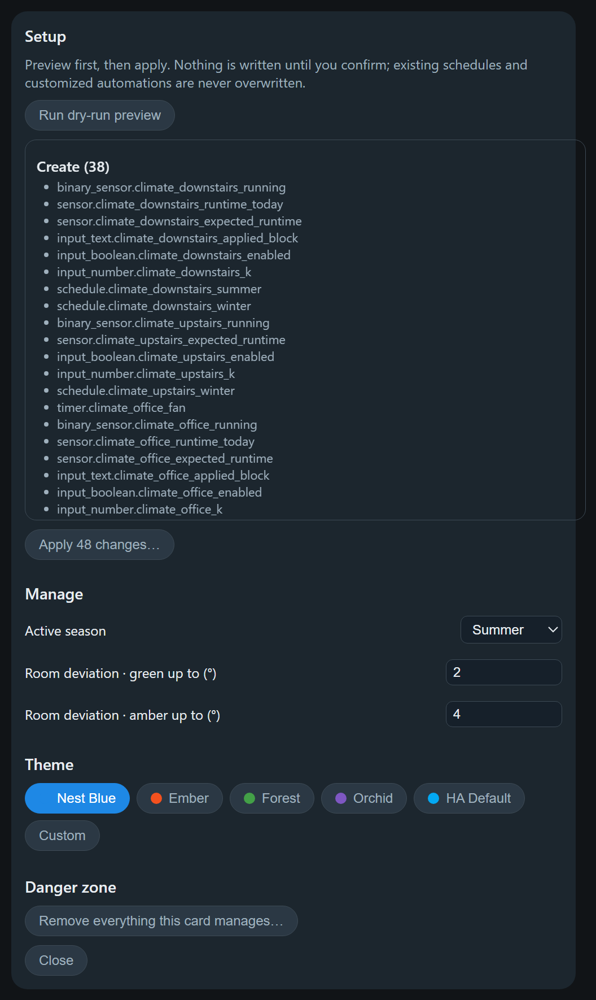
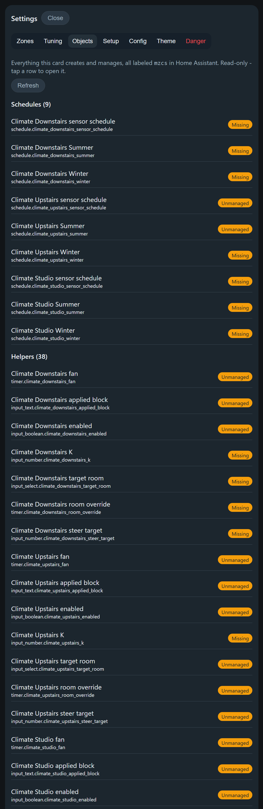
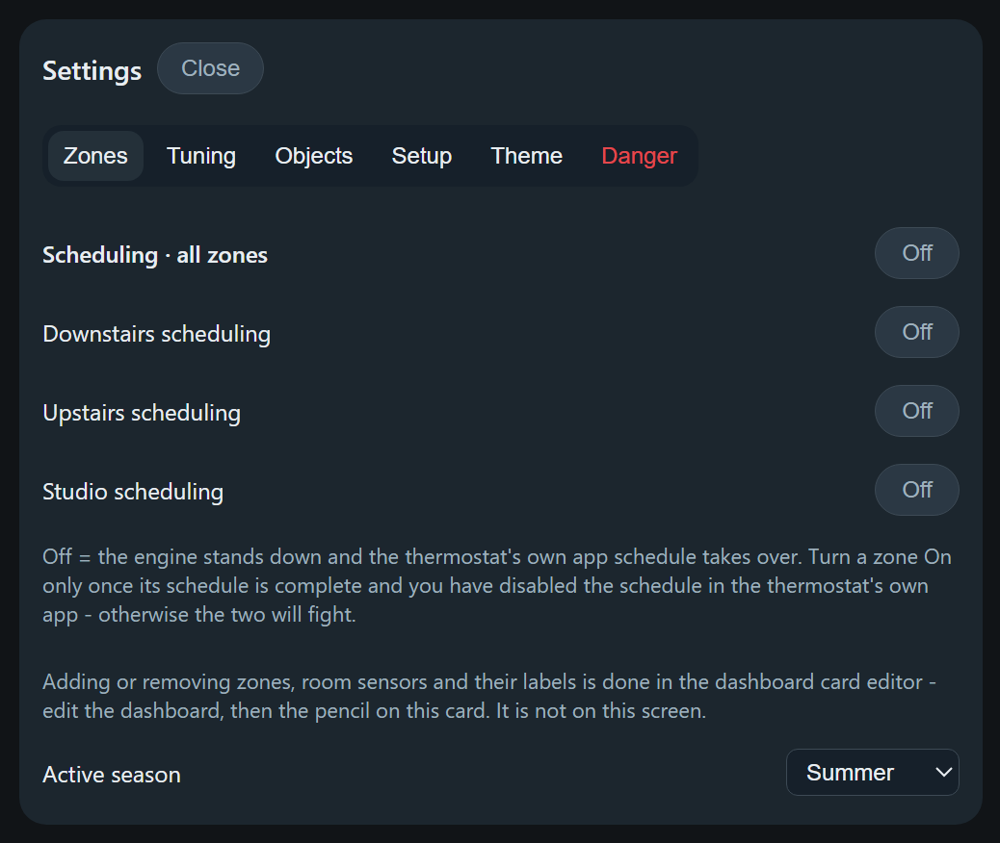
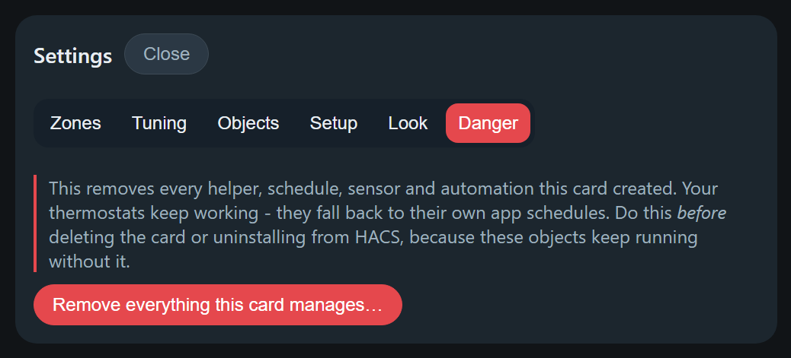

# Multi-Zone Climate Scheduler Card

[](https://hacs.xyz)
[](https://github.com/Coolmanchambers/multizone-climate-scheduler-card/releases)
[](#-project-status-work-in-progress)
[](LICENSE)

**Run your whole house's heating and cooling from one Home Assistant card — with real
schedules that live in Home Assistant, not in your thermostat's cloud app.**

## 🚧 Project status: work in progress

> [!IMPORTANT]
> This card is **actively being developed and is not yet battle-tested across many homes.** It
> has been built and run against a single real multi-zone installation, so expect rough edges,
> gaps, and changes between releases.
>
> It creates and manages real Home Assistant objects and, once you enable a zone, it will
> **change the temperature in your house**. Everything is preview-before-write and every zone
> ships switched off — but please read [Important things to know](#important-things-to-know)
> in full before you enable anything, and start with a single zone.
>
> Feedback and issue reports are genuinely welcome; that is how this gets better.

<p align="center">
  
</p>

---

<p align="center">
  I build this in my free time. If it's useful to you, any little bit helps me keep supporting the
  project and working through feature and bug requests.
</p>

<p align="center">
  <a href="https://buymeacoffee.com/Coolmanchambers">
    
  </a>
</p>

---

## What it is

Most smart thermostats give you one app, one schedule screen, and one zone at a time. If you
have two or three zones — or a mini-split that isn't on the same platform as your thermostats —
you end up juggling apps, and none of it is visible to Home Assistant.

This card replaces that. It gives you:

- **One card for every zone** — a clean, app-style view with tabs, so all your thermostats are
  in one place regardless of brand.
- **Schedules that actually live in Home Assistant** — stored as native `schedule` helpers and
  executed by Home Assistant automations, so they keep running whether or not any dashboard is
  open, and you can see and edit them anywhere in HA.
- **A setup wizard that builds the backend for you** — helpers, schedules, sensors and
  automations are created for you from the card's own Setup screen. No YAML, no copy-pasting
  automations.

The card is the *interface*. Home Assistant does the *work*. Nothing depends on a browser being
open, and nothing depends on this card staying installed once the objects exist.

**What this is, technically:** a custom Lovelace **dashboard card** (frontend JavaScript). It
is *not* a Home Assistant integration — there is no `custom_components/` folder, nothing to
configure in `configuration.yaml`, and no restart required. That distinction matters at
install time; see [Installation](#installation).

### Is this for you?

**A good fit if** you have one to four `climate` entities, you want a single schedule UI across
brands, and you want your automation platform — not a vendor cloud — to own the schedule.

**Probably not a fit if** you only have one thermostat and are happy with its app, you need
per-room damper/valve zoning control (this schedules *thermostats*, it doesn't drive dampers),
or you want the card to control equipment directly (it never does — automations do).

---

## Screenshots

| Zone view | Controls |
|---|---|
|  |  |
| Tabs for each zone, the current setpoint with a stepper, per-room temperature deviations, the next scheduled block, and today's runtime. | Mode, Eco, and one-tap fan timers, tucked behind an expander so the default view stays clean. |

| Visual schedule editor | Runtime history |
|---|---|
|  |  |
| Colored temperature strips per season. Tap a block to edit it. Switch between one schedule for every day, weekday/weekend, or all seven days. | Daily runtime per zone for the last 10 days. Tap a day to see its individual run segments and setpoint changes. |

| Change-set preview | Managed objects |
|---|---|
|  |  |
| **Nothing is ever written silently.** Every apply shows exactly what will be created, adopted, edited, or deleted — by name — and waits for you to confirm. | The Objects tab inventories everything the card manages, each with a status — including automations you've hand-edited, which it will never touch. |

| Scheduling switches | Settings, tabbed |
|---|---|
|  |  |
| Every zone ships **Off**. The Zones tab is where you hand control over, one zone at a time. | Settings are grouped into tabs, with the destructive actions isolated on their own **Danger** tab, far from anything routine. |

---

## How it works

```
   Card (this repo)                Home Assistant backend
   ┌────────────────┐              ┌────────────────────────────┐
   │ display + edit │─ writes ───▶ │ schedule helpers           │
   │ setup wizard   │─ creates ──▶ │ input helpers, sensors     │
   └────────────────┘              │ automations  ◀── execute ──┼──▶ your thermostats
                                   └────────────────────────────┘
```

When you run **Apply** on the Setup screen, the card creates a set of standard Home Assistant
objects, all tagged with the label `mzcs` so you can audit them at any time under
**Settings → Areas, labels & zones → Labels**:

<details>
<summary><b>Exactly what gets created</b> (click to expand)</summary>

**Per zone:**

| Object | Purpose |
|---|---|
| `schedule.<prefix>_<zone>_<season>` | Your schedule, one per zone per season |
| `input_boolean.<prefix>_<zone>_enabled` | The zone's scheduling switch (created **off**) |
| `timer.<prefix>_<zone>_fan` | Backs the one-tap fan timer |
| `binary_sensor.<prefix>_<zone>_running` | True while the zone is actively heating/cooling |
| `sensor.<prefix>_<zone>_runtime_today` | Hours run today |
| `sensor.<prefix>_<zone>_runtime_mirror` | Mirrors runtime for long-term statistics |
| `sensor.<prefix>_<zone>_expected_runtime` | Weather-normalized expectation |
| `input_number.<prefix>_<zone>_k` | Learned runtime per cooling-degree-day |
| `input_text.<prefix>_<zone>_applied_block` | Lets manual changes hold until the next block |

**Global:** an active-season selector, tuning numbers (deviation thresholds, alert margin,
learning window, degree-day base), a theme store, a next-block sensor, and an outdoor
temperature sensor plus its 24-hour mean.

Four more helpers are created and reserved for features that are not shipped yet — a season
mode selector, season confirm/dwell day counts, and a runtime alert day count. They are inert;
nothing reads them today.

**Automations:** the schedule engine, one fan-timer automation per zone, nightly runtime
learning, the runtime anomaly alert, and an engine watchdog.

</details>

The **schedule engine** automation applies the active season's current block to each *enabled*
zone at every block transition, on Home Assistant restart, and on a 15-minute safety tick that
re-asserts the current block if a transition was ever missed.

---

## Requirements

- A current Home Assistant release (developed and tested against 2026.x; requires native
  `schedule` helpers with custom block data).
- One to four `climate` entities.
- **Optional:** a `weather` entity — enables outdoor-temperature tracking, runtime learning,
  and the anomaly alert. Everything else works without it, but see the note on the outdoor
  sensors under [Troubleshooting](#troubleshooting): without a weather entity the preview keeps
  listing two of them as pending, by design.
- **Optional:** temperature sensors per room, for the deviation chips.

---

## Installation

> [!IMPORTANT]
> **This is a dashboard card, not an integration.** When you add it to HACS you must choose
> the category **Dashboard** (older HACS versions call the same thing **Lovelace** or
> **Plugin**). Choosing *Integration* makes HACS look for a `custom_components/` folder,
> which a card does not have — it will refuse the repository with
> *"repository structure is not compliant"*. If you see that error, this is why.

### Via HACS (recommended)

1. In Home Assistant, open **HACS**.
2. Click the three-dot menu (top right) → **Custom repositories**.
3. Paste the repository URL:
   ```
   https://github.com/Coolmanchambers/multizone-climate-scheduler-card
   ```
4. Set **Type / Category** to **Dashboard** — *not* Integration. (On older HACS this dropdown
   reads **Lovelace** or **Plugin**; pick that instead — it is the same category.)
5. Click **Add**, then search HACS for **Multi-Zone Climate Scheduler Card** and click
   **Download**.
6. Reload your browser (hard refresh, or clear the frontend cache in the Companion app).

HACS registers the dashboard resource for you — there is nothing to add to
`configuration.yaml`, and no Home Assistant restart is needed. A card only needs a browser
refresh.

### Manual

1. Download `multizone-climate-scheduler-card.js` from the
   [latest release](https://github.com/Coolmanchambers/multizone-climate-scheduler-card/releases).
2. Copy it into `config/www/`.
3. Go to **Settings → Dashboards → ⋮ → Resources → Add resource**, URL
   `/local/multizone-climate-scheduler-card.js`, type **JavaScript module**.
4. Reload your browser.

### Beta releases (optional)

Some builds ship first as **betas**, published as GitHub pre-releases. HACS hides those unless
you ask for them, so **you will never be given one by accident** — stable is the default and
requires nothing from you.

If you want to help test, enable the **Pre-release** switch on the card's device under
**Settings → Devices & services → HACS** (it's disabled by default, so you enable the entity
first, then turn it on). Betas then show up in HACS like any other update.

Rolling back is quick and safe: HACS → three-dot menu → **Redownload** → **Need a different
version?** → pick the last good one, then hard-refresh. Your schedules and helpers live in Home
Assistant, not in the card, so nothing is lost.

Full instructions, including how to confirm which version is actually running and what to put in
a report: **[Beta testing guide](docs/beta-testing.md)**.

---

## Quick start

Budget about ten minutes. **Nothing touches your thermostats until step 7 — and step 7 is
entirely up to you.** Steps 1 to 6 are safe to do at any time of day.

### 1. Add the card

On any dashboard: **Edit dashboard → Add card → search "Multi-Zone Climate Scheduler"**.
Everything below is configured in the visual editor; you never need to write YAML.

### 2. Add your zones

For each zone, give it a display name (e.g. "Upstairs") and pick its `climate` entity.
Optionally add room temperature sensors — those become the deviation chips on the card.

### 3. Set up your seasons

Two are created for you: *Summer* (cool) and *Winter* (heat·cool). Rename, add, or remove them
to match how you actually run your house. A season's default mode decides whether its blocks
are cooling setpoints, heating setpoints, or a heat·cool range with both.

### 4. Preview, then apply

Open the card's gear icon → **Setup** tab → **Run dry-run preview**. You get an itemized list
of every object that will be created. Read it, then press **Apply**.

<p align="center">
  
</p>

This creates the backend objects. **Every zone is created with scheduling switched off**, so at
this point your house still behaves exactly as it did before.

### 5. Build your schedule

Tap the **Next ·** row to open the schedule editor. Pick your granularity (every day /
weekday·weekend / individual days), then tap any block to set its time, name, and temperature.
Changes stage locally until you press **Save**.

<p align="center">
  
</p>

Do this for **every zone and every season** you configured. A season with no schedule of its own
will do nothing when it becomes active.

### 6. Verify before you hand over control ✅

This is the checkpoint that matters. Before enabling any zone, confirm all four:

- [ ] **Your schedules are complete and correct** — every zone, every season, right times, right
      temperatures. Re-read them in the card.
- [ ] **The schedule in your thermostat's own app is turned OFF** — whichever brand and app
      you use. Also turn off any "learning" or "auto-schedule" feature.
      See the [warning below](#turn-off-your-thermostats-own-schedule-first) for why.
- [ ] **The right season is selected** on the **Zones** tab.
- [ ] **You're around to watch it.** Enable during a day you'll be home, not the night before a
      trip.

### 7. Enable scheduling, one zone at a time

Gear icon → **Zones** tab. Every zone ships **Off**, meaning the engine stands down and your
thermostat's own app is still in charge. Turn a zone **On** and the engine starts applying your
schedule to it at the next block.

<p align="center">
  
</p>

**Start with a single zone.** Watch it through at least one scheduled block change and confirm
the setpoint lands where you expect. Once you trust it, enable the rest. If anything looks
wrong, switch the zone back **Off** — control returns to your thermostat's app immediately.

---

## Important things to know

These are the things most likely to surprise you. Please read them before enabling a zone.

### Turn off your thermostat's own schedule first

> [!WARNING]
> If your thermostat's own app still has its own schedule running, you now have **two
> schedulers fighting over one thermostat.** The symptom is setpoints that appear to "change
> themselves" at odd times. Turn off the schedule — and any learning or auto-schedule feature —
> in the vendor app for every zone you enable here.

The card cannot see inside your thermostat's app, but it can see most of Home Assistant.
**Running a dry-run preview also scans your automations and scripts (up to 500) for anything else
that writes to a scheduled zone** - service calls, UI-built climate device actions, and blueprint
automations whose inputs name a zone - matching by entity, area, device and label. It is advisory
and never blocks Apply. What it cannot see is stated in the panel: automations and scripts defined
in YAML are not readable through Home Assistant's config API, blueprint automations are checked by
their configured inputs only, scenes are not scanned, and anything outside Home Assistant
automations entirely (Node-RED, vendor apps, HomeKit/Alexa routines) is invisible to it.

### Every zone ships switched off, and only you can turn it on

Zones are created with scheduling **Off**. No reconfiguration, rename, or re-apply can ever flip
that for you — enabling is always a deliberate act. Switching a zone back **Off** at any time
makes the engine stand down immediately and hands full control to your thermostat's own app.
That is your escape hatch during setup, testing, or any problem, and there's an all-zones master
switch above the per-zone ones.

<p align="center">
  
</p>

### Manual changes hold until the next block

If you nudge the temperature by hand, the engine will **not** fight you — your change holds
until the next scheduled block, then the schedule resumes. This is deliberate. If you want the
schedule re-applied right now, use **Apply now** in the schedule editor.

### A standby preset makes a zone stand down

While a zone's thermostat reports its standby preset — **`eco` by default**, the most common
name for it —
the engine leaves that zone completely alone. This is handy for away modes, and confusing if
you forgot the preset was on. If your thermostat uses a different name for the same idea
(`away`, `sleep`, ...), set it in the editor under **Features → Standby preset name**; the
card's Eco chip follows the same setting. Check your thermostat's preset list in Home
Assistant for the exact name it reports.

You can also switch the stand-down off entirely so Home Assistant owns standby — but
deliberately: with it off, the engine keeps applying schedule setpoints even while a
thermostat is in its Eco/away mode, **overriding and likely fighting the device's or its
app's own standby behavior**. Only disable it if you've turned those features off on the
device itself. The editor shows this warning when you untick it.

<p align="center">
  
</p>

### Off-peak comfort

On days that cost less to run - typically weekends, plus utility holidays - you can prefer
comfort over economy without touching your schedule. Point `features.off_peak_entity` (editor:
**Off-peak comfort**) at a switch or binary sensor that is **ON when today is off-peak**. While
it is on, the engine applies each block moved toward comfort by the offset: cooling setpoints
lower, heating setpoints higher, `heat_cool` bands widened, `off` blocks untouched. The card
shows an **Off-peak** chip next to the next-block line and the next-block temperature reflects
the adjusted target. If the flag is wrong for a day (a holiday your utility does not observe),
tap the chip to **pause off-peak for today** - it resumes by itself at midnight.

The card deliberately consumes ONE boolean and never reads calendars itself, so all the day
judgement stays in an entity you own and can extend. The recommended recipe is two helpers:

1. **A local calendar for the exceptions.** Settings → Devices & Services → Helpers → Create
   helper → **Local calendar**, e.g. "Peak Holidays". Add an all-day event for each utility
   holiday. (A subscribed ICS calendar works identically.)
2. **A template binary sensor combining weekend + calendar.** Create helper → **Template** →
   *Template a binary sensor*, e.g. "Off Peak Today":

   ```jinja
   {{ now().weekday() >= 5 or is_state('calendar.peak_holidays', 'on') }}
   ```

   `weekday()` is 0=Mon…6=Sun, so `>= 5` means Sat/Sun. An all-day calendar event reports `on`
   for that whole day. Weekends-only: drop the calendar term. Holidays-only: drop the weekday
   term. A utility with seasonal windows can extend the same template - which is exactly why
   the logic belongs to you, and any existing peak/off-peak automation can drive it on day one.

The offset itself lives in a provisioned helper (default 2°, range 0-10) on the settings
**Tuning** tab, so you can tune it any time without re-provisioning. The engine fails safe: if
the entity is missing or unavailable, the schedule applies exactly as written. On heat_cool
blocks the adjustment is capped so at least a 2° gap always survives between the two setpoints.

One nuance to the "manual changes hold until the next block" rule on off-peak installs: an
off-peak flip (or an offset tune) mid-block re-applies the schedule within 15 minutes, which
also releases a manual hold made during that block. That is the trade that makes a holiday
comfortable from its first block.

### Comfort steering

A thermostat cools its whole zone from one sensor in one spot. When what you actually care
about is a different room ("cool the office to 76"), enable `features.steering` and tap that
room on the card: pick a target and a duration, and the card drives the thermostat until THAT
room reaches the target - by commanding `thermostat reading - (room reading - target)`, clamped
to a tunable band and to a max offset from your scheduled setpoint. The rest of the zone may
overshoot while the room catches up; that is the point, not a bug. When the time is up (or you
cancel), the schedule takes the zone back automatically.

Worth knowing:

- **Cool-only for now.** Steering acts on cooling blocks; heating support can follow.
- **The schedule engine steps aside** while an override runs, and re-asserts the block within
  15 minutes of it ending.
- **Refusals are visible.** A stale or unavailable room sensor refuses to start an override; a
  disabled zone or an active standby preset disables Start with the reason shown. Disabling a
  zone mid-override cancels it - the kill switch outranks everything.
- **Room by time of day (dayparts).** On the settings Zones tab you can map stretches of the
  day to rooms ("nights follow the bedroom"). During such a daypart the zone steers its
  scheduled setpoint to that room continuously. A manual override from the main screen always
  wins until it expires, then the daypart resumes.
- Tunables (band, max offset, default duration) live on the settings **Tuning** tab.

### Removing the card does NOT remove what it created

> [!CAUTION]
> The helpers, schedules, sensors, and automations are real Home Assistant objects, and they
> **keep running your thermostats even after the card is gone.** Deleting the card from your
> dashboard — or uninstalling it from HACS — does not stop them, and afterwards you no longer
> have the UI that cleans them up.
>
> **Always run "Remove everything this card manages" (gear icon → **Danger** tab) _before_
> deleting the card.** See
> [Uninstalling](#uninstalling) for the correct order.

<p align="center">
  
</p>

### Hand-edit a generated automation and you own it from then on

Each generated automation carries a content signature. If you edit one, the card detects that
and will **never** overwrite or delete it — which also means it stops receiving improvements
when your config changes. That's the trade: edit freely, but the card steps back permanently for
that automation.

### heat·cool blocks need both temperatures

A heat·cool block sets a target *range*. Both the cool and heat values must be present, and the
card keeps a minimum gap between them.

### Learning takes time, and needs a weather entity

The runtime anomaly alert stays quiet until it has learned each zone's runtime-per-degree-day.
Expect it to read "learning" for several warm days after setup, and note that it only learns on
days with meaningful cooling demand. No weather entity means no learning and no alerts — the
rest of the card is unaffected.

### Moving or copying the card to another dashboard

**Good news: you can move the card freely and nothing needs redoing.** The card is only a
window onto objects that live in Home Assistant — your schedules, helpers, and automations
aren't stored in the card or in the dashboard. Cut and paste the card to a different dashboard,
or rebuild it there from the same config, and it reconnects to everything as soon as it loads.
Nothing is re-provisioned and no schedule is lost.

The one rule: **keep the config identical** — same `prefix`, same zone names, same seasons. What
ties a card to its objects is the prefix plus the zone names, so as long as those match, any
number of copies on any number of dashboards all drive the same system. Having the card on your
wall tablet *and* your phone dashboard is completely normal.

> [!WARNING]
> Copies with **different** configs are the thing to avoid. Because each card computes what
> *should* exist from its own config, running **Apply** on a copy that is missing a zone or
> season will plan to **delete** that zone's objects — the ones the other copy still expects.
> The preview will show you those deletions before anything happens, but it's an easy trap. If
> you want a genuinely separate setup (a test copy, a guest house), give it a *different*
> `prefix` so the two never touch each other's objects.

Two related gotchas, both of which are rename-then-recreate rather than in-place edits:
**changing the `prefix`** orphans everything under the old one and builds a fresh set, and
**renaming a zone** changes its entity ids, so the differ plans new objects plus deletion of the
old ones. Both are previewed before they run, but neither is a quick cosmetic tweak — rename
deliberately.

### Deleting a zone or season deletes its objects

Removing a zone or season from the config plans deletion of the objects that belonged to it,
including that zone's schedules. You always see this in the preview before confirming, and the
contents are written to the log first, but the deletion is real.

---

## Day-to-day use

The gear icon opens the settings panel, grouped into tabs: **Zones** (scheduling switches and
the active season), **Tuning** (thresholds and learning values), **Objects** (everything the
card manages), **Setup** (preview and apply), **Theme**, and **Danger** (removal, kept
deliberately apart from everything else).

| I want to… | Do this |
|---|---|
| Change the temperature now | Use the **+ / −** stepper. It holds until the next block. |
| Change today's schedule permanently | Tap the **Next ·** row → tap the block → edit → **Save**. |
| Run the fan for a bit | Expand **Mode** → tap **15m / 30m / 60m**. It shuts off automatically. |
| Switch seasons | Gear icon → **Zones** tab → **Active season**. |
| Stop all automation immediately | Gear icon → **Zones** tab → switch the zone (or the master) **Off**. |
| See how much the system ran | Tap the **Runtime ·** row; tap a day for its individual runs. |
| Change the look | Gear icon → **Theme** tab. |
| See everything the card manages | Gear icon → **Objects** tab. |
| Report a bug | Gear icon → **Objects** tab → **Build report**. |
| Move the card to another dashboard | Just move it — see [Moving or copying the card](#moving-or-copying-the-card-to-another-dashboard). Nothing is re-provisioned. |

You can also edit any schedule from **Settings → Devices & Services → Helpers** using Home
Assistant's own schedule editor — the card reads whatever is there.

---

## Configuration reference

> **Use the visual editor to configure this card.** Edit the dashboard, then click the pencil on
> this card. It is *not* behind the card's gear icon — that opens the settings panel, which tunes
> a card that is already configured. The visual editor writes the current shape for everything you
> change through it. (It does not retro-fix a hand-written config you paste in.)
>
> Hand-writing this YAML is supported but easy to get subtly wrong, because a config that looks
> fine can still be missing a field that ends up baked into entity names. The clearest example is
> `seasons[].key`: leave it out on two seasons and they collide, and the card refuses to provision
> until you give each one its own. Leave it out on a single season and the card still works
> (since 0.7.3 its schedule row opens too). Other fields silently fall back to defaults you may not
> have intended.
>
> If you do write it by hand, run the dry-run (gear icon → **Setup** tab → **Run dry-run preview**)
> and read it before applying. A healthy, fully provisioned install settles to all Unchanged -
> except without a `weather_entity`, where two pending creates are expected forever (see
> [Troubleshooting](#troubleshooting)).

The reference below is for understanding what the editor produced, and for YAML-mode users who
have read the warning above. Old config shapes keep working: see
[config compatibility](docs/config-compatibility.md).

```yaml
type: custom:multizone-climate-scheduler-card
prefix: climate                       # namespace for all created objects
zones:
  - name: Downstairs
    entity: climate.downstairs_thermostat
  - name: Upstairs
    entity: climate.upstairs_thermostat
    room_sensors:                     # optional, drives deviation chips
      - sensor.bedroom_3_temperature           # uses the entity's own name
      - entity: sensor.zb_landing_temp_sensor      # or label it yourself
        name: Landing
        last_seen: sensor.zb_landing_temp_sensor_last_seen  # optional, see below
seasons:
  - key: summer                       # REQUIRED - fixed id used in entity names
    name: Summer                      # display name; rename freely, key stays
    default_mode: cool                # cool | heat | heat_cool | off
  - key: winter
    name: Winter
    default_mode: heat_cool
weather_entity: weather.home          # optional, enables runtime learning
features:
  fan_timer: [15, 30, 60]             # minutes; use [] to hide the fan chips
  anomaly_alerts: true
  fan_guard: input_boolean.help_fan   # optional: fan-off automations stand
                                      # down while this helper is on
  eco_preset: away                    # optional: standby preset the engine
                                      # respects ('eco' default; false disables)
  off_peak_entity: binary_sensor.off_peak_today  # optional: ON = today is off-peak,
                                      # schedule applies with extra comfort
  off_peak_offset: 2                  # optional: degrees of extra comfort
                                      # (initial value for the offset helper)
display:                              # optional, presentation only
  last_seen: always                   # always | ageing | off
  ageing_minutes: 45
  stale_hours: 3
```

| Key | Type | Default | Notes |
|---|---|---|---|
| `prefix` | string | `climate` | Lowercase letters, digits and underscores. The visual editor slugifies what you type; hand-written YAML is used as-is, so keep to that shape. |
| `zones[].name` | string | — | Display name; also determines the zone's entity ids. |
| `zones[].entity` | string | — | Any `climate.*` entity. |
| `zones[].room_sensors` | list | — | Temperature sensors shown as deviation chips. Each item is either an entity id or `{entity, name, last_seen}` when you want a different label than the entity's friendly name, or a last-seen companion. |
| `zones[].room_sensors[].last_seen` | string | — | Optional timestamp entity carrying when the sensor's device last actually reported (e.g. a Zigbee2MQTT `_last_seen` entity). When set and reporting, it joins the stale check for that row and shows an age label; if it goes missing or unavailable the row quietly falls back to the standard check, with no age shown. The editor can suggest matches. Without it the row behaves exactly as before. |
| `seasons[].key` | string | — | **Required.** Fixed id used in this season's entity names. Choose it once and leave it — changing it renames every object for that season. |
| `seasons[].name` | string | — | Display name. Safe to rename at any time; the `key` is what entity ids use. |
| `seasons[].default_mode` | enum | — | `cool`, `heat`, `heat_cool`, or `off`. |
| `season_switch` | enum | `manual` | Written by the visual editor; only `manual` does anything today (the auto modes are the planned recommender). |
| `weather_entity` | string | — | Enables outdoor tracking, learning, and alerts. |
| `features.fan_timer` | list | `[15,30,60]` | Fan timer presets, in minutes. Omitting the key keeps the defaults; set it to `[]` to hide the chips and skip the fan timers and their automations. |
| `features.anomaly_alerts` | bool | `true` | Creates the evening runtime alert automation. |
| `features.fan_guard` | string | — | A helper that suppresses fan-off while it is on. |
| `features.eco_preset` | string \| `false` | `eco` | Standby preset the engine stands down for; `false` disables the gate. |
| `features.off_peak_entity` | string | — | A `binary_sensor` or `input_boolean` that is **ON when today is off-peak**. While on, the engine applies each block moved toward comfort by the offset (cooling lower, heating higher; `off` blocks unchanged). Omit to keep the feature off. See [Off-peak comfort](#off-peak-comfort). |
| `features.off_peak_offset` | number | `2` | Degrees of extra comfort, 0-10. This is the **initial value** for the provisioned offset helper - after Apply, tune the live value on the settings Tuning tab. |
| `features.steering` | bool | `false` | Comfort steering (cool-only v1): tap a room to drive the zone until THAT room reaches a target, plus an optional room-by-time-of-day schedule. Adds per-zone helpers and a steering automation on the next Apply. See [Comfort steering](#comfort-steering). |
| `display.last_seen` | enum | `always` | Age label on room rows that have a `last_seen` companion: `always`, `ageing` (only past the ageing threshold), or `off`. Rows without a companion never show one. |
| `display.ageing_minutes` | number | `45` | Age at which the label turns amber (and appears, in `ageing` mode). |
| `display.stale_hours` | number | `3` | Hours without a report before a reading is greyed out and marked stale. |

---

## Uninstalling

> [!CAUTION]
> **Do these steps in order.** The backend objects outlive the card. If you delete the card
> first, its automations keep driving your thermostats and the cleanup UI is gone.

1. On the card: gear icon → **Danger** tab → **Remove everything this card manages…**

   <p align="center">
     
   </p>

2. Answer the **Are you sure?** prompt. Nothing has been read or deleted yet.
3. Read the red preview listing every object that will be deleted.
4. **Type your entity prefix** (`climate` unless you changed it) into the confirmation box. The
   delete button stays disabled until it matches exactly — and the list is re-checked against
   Home Assistant at that moment, so if anything changed since the preview you're asked to
   review it and confirm again.
5. Confirm. The card switches all zones **off first** (so your thermostats hand back to their own
   apps immediately), then removes the automations, sensors, schedules, and helpers in dependency
   order, writing contents to the log as it goes.
6. Delete the card from your dashboard.
7. Uninstall from HACS if you're done with it.

If you skip step 1 and later want to clean up by hand, everything the card created carries the
`mzcs` label: **Settings → Areas, labels & zones → Labels → mzcs** lists all of it.

---

## Troubleshooting

**HACS says "repository structure is not compliant".** The repository was added under the
wrong category. This is a **Dashboard** card (called **Lovelace** or **Plugin** in older HACS
versions), not an Integration. Remove the custom repository and re-add it with the correct
category.

**The card doesn't appear after installing.** Hard-refresh the browser. In the Companion app,
use **Settings → Companion App → Troubleshooting → Reset frontend cache**, then force-quit and
reopen.

**My schedule isn't being applied.** Check, in this order: (1) the zone's scheduling switch is
**On**; (2) the thermostat isn't in its standby preset; (3) the correct season is selected on
the **Zones** tab;
(4) `automation.<prefix>_schedule_engine` is enabled. The engine watchdog will notify you if that
automation goes missing or off for five minutes.

**Setpoints change at times I didn't schedule.** Almost always the vendor app's own schedule is
still active — see [the warning above](#turn-off-your-thermostats-own-schedule-first).

**Runtime says "learning" forever.** You need a weather entity configured, and enough warm days
for the nightly learning to run. It skips mild days by design.

**Apply says an automation was "kept".** That automation was hand-edited, so the card left it
alone on purpose — the **Objects** tab marks it *Customized*. Delete it manually if you want a
fresh generated copy.

**Re-running Apply keeps showing the same edit.** Open an issue and attach a diagnostics report — a
healthy install settles to "Unchanged" for everything after one apply.

**The preview always shows 2 pending creates, and I have no weather entity.** That is expected, not
a bug. The two outdoor sensors are always part of the plan so that an existing one is never queued
for deletion, but they are only actually created when a weather entity is configured. With no
weather entity they stay pending indefinitely and nothing else is affected. Set a weather entity,
or ignore those two.

**Reporting a bug — send a diagnostics report.** Gear icon → **Objects** tab → **Build report**.
It gathers the card version, your Home Assistant version, the shape of your configuration, the
result of your last preview, and the status of everything the card manages.

> [!NOTE]
> **Your entity ids and the names you gave your zones and rooms are left out by default.** So are
> your season names, your entity prefix, and the value of any free-text option. What remains is
> structure: how many zones and seasons, which options are set, your per-zone scheduling switch
> states, the result of your last preview, and your browser and platform (e.g. "Chrome on
> Android") — not your device model or OS build.
>
> There is a tick-box to include the identifiers if a maintainer asks, and the report is shown to
> you in full before you copy it, so you always see exactly what you are sharing.

---

## Not in this release

Being upfront so nothing surprises you. These are planned, not shipped:

- **Automatic season switching.** The Manual selector works; the Semi-auto and Full-auto options
  are disabled placeholders for a forecast-driven recommender.
- **Consecutive-day anomaly alerts and actionable mobile notifications.** Today's alert is a
  single-evening check delivered as a persistent notification.
- **Automatic area/category assignment** for created objects. Everything gets the `mzcs` label.

---

## Development

```bash
npm install
npm run dev        # Vite dev server with the mock-hass harness (no HA needed)
npm test           # unit suite
npm run typecheck
npm run build      # release bundle -> dist/multizone-climate-scheduler-card.js
npm run build:dev  # parallel dev element (multizone-climate-scheduler-card-dev)
```

`npm run build:dev` produces a bundle that registers a separate
`multizone-climate-scheduler-card-dev` element, so you can run a development copy alongside the
HACS-installed release on the same Home Assistant instance.

The pure logic (schedule resolution, naming, the provisioning differ, degree-day math) lives in
`src/lib/` with no Lit or Home Assistant imports, and is unit-tested. All Home Assistant
touchpoints are isolated in `src/ha-adapter.ts`.

Documentation screenshots are real renders of the card, captured from the dev harness — see
`scripts/shoot.py`.

See [CONTRACT.md](CONTRACT.md) for the frozen naming and schema contract, and
[CHANGELOG.md](CHANGELOG.md) for release history.

## Contributing

Issues and pull requests are welcome — and while the project is still finding its feet, bug
reports are especially valuable. For bugs, the fastest thing you can send is a **diagnostics
report** — gear icon → **Objects** tab → **Build report** — which carries the versions, your
configuration's shape and the last preview result, with your entity ids and room names left out
by default.

If you'd like to test changes before they reach everyone, see the
[Beta testing guide](docs/beta-testing.md).

## Support

Everything here runs in my own house before it ships anywhere else. If it saved you an evening,
[a coffee](https://buymeacoffee.com/Coolmanchambers) is welcome — entirely optional, and a good
bug report is worth just as much.

## License

[MIT](LICENSE)
