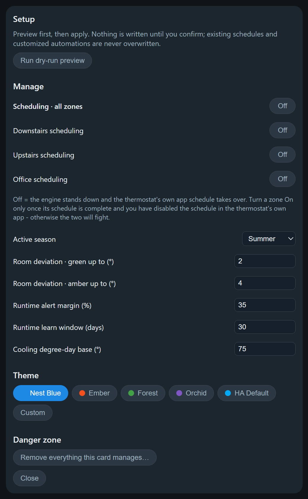

# Multi-Zone Climate Scheduler Card

[](https://hacs.xyz)
[](https://github.com/Coolmanchambers/multizone-climate-scheduler-card/releases)
[](#-project-status-work-in-progress)
[](LICENSE)

**Run your whole house's heating and cooling from one Home Assistant card — with real
schedules that live in Home Assistant, not in your thermostat's cloud app.**

## 🚧 Project status: work in progress

> [!IMPORTANT]
> This card is **actively being developed and is not yet battle-tested across many homes.** It
> has been built and run against a single real multi-zone installation, so expect rough edges,
> gaps, and changes between releases.
>
> It creates and manages real Home Assistant objects and, once you enable a zone, it will
> **change the temperature in your house**. Everything is preview-before-write and every zone
> ships switched off — but please read [Important things to know](#important-things-to-know)
> in full before you enable anything, and start with a single zone.
>
> Feedback and issue reports are genuinely welcome; that is how this gets better.

<p align="center">
  
</p>

---

## What it is

Most smart thermostats give you one app, one schedule screen, and one zone at a time. If you
have two or three zones — or a mini-split that isn't on the same platform as your thermostats —
you end up juggling apps, and none of it is visible to Home Assistant.

This card replaces that. It gives you:

- **One card for every zone** — a Nest-style view with tabs, so all your thermostats are in one
  place regardless of brand.
- **Schedules that actually live in Home Assistant** — stored as native `schedule` helpers and
  executed by Home Assistant automations, so they keep running whether or not any dashboard is
  open, and you can see and edit them anywhere in HA.
- **A setup wizard that builds the backend for you** — helpers, schedules, sensors and
  automations are created for you from the card's own Setup screen. No YAML, no copy-pasting
  automations.

The card is the *interface*. Home Assistant does the *work*. Nothing depends on a browser being
open, and nothing depends on this card staying installed once the objects exist.

### Is this for you?

**A good fit if** you have one to four `climate` entities, you want a single schedule UI across
brands, and you want your automation platform — not a vendor cloud — to own the schedule.

**Probably not a fit if** you only have one thermostat and are happy with its app, you need
per-room damper/valve zoning control (this schedules *thermostats*, it doesn't drive dampers),
or you want the card to control equipment directly (it never does — automations do).

---

## Screenshots

| Zone view | Controls |
|---|---|
|  |  |
| Tabs for each zone, the current setpoint with a stepper, per-room temperature deviations, the next scheduled block, and today's runtime. | Mode, Eco, and one-tap fan timers, tucked behind an expander so the default view stays clean. |

| Visual schedule editor | Runtime history |
|---|---|
|  |  |
| Colored temperature strips per season. Tap a block to edit it. Switch between one schedule for every day, weekday/weekend, or all seven days. | Daily runtime per zone, 7 or 30 days. Tap a day to see its individual run segments and setpoint changes. |

| Change-set preview | Setup and Manage |
|---|---|
|  |  |
| **Nothing is ever written silently.** Every apply shows exactly what will be created, adopted, edited, or deleted — by name — and waits for you to confirm. | Per-zone scheduling switches, active season, tuning values, themes, and the one-click removal of everything the card created. |

---

## How it works

```
   Card (this repo)                Home Assistant backend
   ┌────────────────┐              ┌────────────────────────────┐
   │ display + edit │─ writes ───▶ │ schedule helpers           │
   │ setup wizard   │─ creates ──▶ │ input helpers, sensors     │
   └────────────────┘              │ automations  ◀── execute ──┼──▶ your thermostats
                                   └────────────────────────────┘
```

When you run **Apply** on the Setup screen, the card creates a set of standard Home Assistant
objects, all tagged with the label `mzcs` so you can audit them at any time under
**Settings → Areas, labels & zones → Labels**:

<details>
<summary><b>Exactly what gets created</b> (click to expand)</summary>

**Per zone:**

| Object | Purpose |
|---|---|
| `schedule.<prefix>_<zone>_<season>` | Your schedule, one per zone per season |
| `input_boolean.<prefix>_<zone>_enabled` | The zone's scheduling switch (created **off**) |
| `timer.<prefix>_<zone>_fan` | Backs the one-tap fan timer |
| `binary_sensor.<prefix>_<zone>_running` | True while the zone is actively heating/cooling |
| `sensor.<prefix>_<zone>_runtime_today` | Hours run today |
| `sensor.<prefix>_<zone>_expected_runtime` | Weather-normalized expectation |
| `input_number.<prefix>_<zone>_k` | Learned runtime per cooling-degree-day |
| `input_text.<prefix>_<zone>_applied_block` | Lets manual changes hold until the next block |

**Global:** an active-season selector, tuning numbers (deviation thresholds, alert margin,
learning window, degree-day base), a theme store, a next-block sensor, and — if you set a
weather entity — an outdoor temperature sensor plus its 24-hour mean.

**Automations:** the schedule engine, one fan-timer automation per zone, nightly runtime
learning, the runtime anomaly alert, and an engine watchdog.

</details>

The **schedule engine** automation applies the active season's current block to each *enabled*
zone at every block transition, on Home Assistant restart, and on a 15-minute safety tick that
re-asserts the current block if a transition was ever missed.

---

## Requirements

- A current Home Assistant release (developed and tested against 2026.x; requires native
  `schedule` helpers with custom block data).
- One to four `climate` entities.
- **Optional:** a `weather` entity — enables outdoor-temperature tracking, runtime learning,
  and the anomaly alert. Everything else works without it.
- **Optional:** temperature sensors per room, for the deviation chips.

---

## Installation

### Via HACS (recommended)

1. In Home Assistant, open **HACS**.
2. Click the three-dot menu (top right) → **Custom repositories**.
3. Add the repository URL below, with type **Dashboard**:
   ```
   https://github.com/Coolmanchambers/multizone-climate-scheduler-card
   ```
4. Search HACS for **Multi-Zone Climate Scheduler Card** and click **Download**.
5. Reload your browser (hard refresh, or clear the frontend cache in the Companion app).

HACS registers the dashboard resource for you.

### Manual

1. Download `multizone-climate-scheduler-card.js` from the
   [latest release](https://github.com/Coolmanchambers/multizone-climate-scheduler-card/releases).
2. Copy it into `config/www/`.
3. Go to **Settings → Dashboards → ⋮ → Resources → Add resource**, URL
   `/local/multizone-climate-scheduler-card.js`, type **JavaScript module**.
4. Reload your browser.

---

## Quick start

Budget about ten minutes. **Nothing touches your thermostats until step 7 — and step 7 is
entirely up to you.** Steps 1 to 6 are safe to do at any time of day.

### 1. Add the card

On any dashboard: **Edit dashboard → Add card → search "Multi-Zone Climate Scheduler"**.
Everything below is configured in the visual editor; you never need to write YAML.

### 2. Add your zones

For each zone, give it a display name (e.g. "Upstairs") and pick its `climate` entity.
Optionally add room temperature sensors — those become the deviation chips on the card.

### 3. Set up your seasons

Two are created for you: *Summer* (cool) and *Winter* (heat·cool). Rename, add, or remove them
to match how you actually run your house. A season's default mode decides whether its blocks
are cooling setpoints, heating setpoints, or a heat·cool range with both.

### 4. Preview, then apply

Open the card's gear icon → **Setup** → **Run dry-run preview**. You get an itemized list of
every object that will be created. Read it, then press **Apply**.

<p align="center">
  
</p>

This creates the backend objects. **Every zone is created with scheduling switched off**, so at
this point your house still behaves exactly as it did before.

### 5. Build your schedule

Tap the **Next ·** row to open the schedule editor. Pick your granularity (every day /
weekday·weekend / individual days), then tap any block to set its time, name, and temperature.
Changes stage locally until you press **Save**.

<p align="center">
  
</p>

Do this for **every zone and every season** you configured. A season with no schedule of its own
will do nothing when it becomes active.

### 6. Verify before you hand over control ✅

This is the checkpoint that matters. Before enabling any zone, confirm all four:

- [ ] **Your schedules are complete and correct** — every zone, every season, right times, right
      temperatures. Re-read them in the card.
- [ ] **The schedule in your thermostat's own app is turned OFF** — Nest, ecobee, Honeywell,
      SmartThings, whatever you use. Also turn off any "learning" or "auto-schedule" feature.
      See the [warning below](#turn-off-your-thermostats-own-schedule-first) for why.
- [ ] **The right season is selected** on the Manage screen.
- [ ] **You're around to watch it.** Enable during a day you'll be home, not the night before a
      trip.

### 7. Enable scheduling, one zone at a time

Gear icon → **Manage**. Every zone ships **Off**, meaning the engine stands down and your
thermostat's own app is still in charge. Turn a zone **On** and the engine starts applying your
schedule to it at the next block.

<p align="center">
  
</p>

**Start with a single zone.** Watch it through at least one scheduled block change and confirm
the setpoint lands where you expect. Once you trust it, enable the rest. If anything looks
wrong, switch the zone back **Off** — control returns to your thermostat's app immediately.

---

## Important things to know

These are the things most likely to surprise you. Please read them before enabling a zone.

### Turn off your thermostat's own schedule first

> [!WARNING]
> If your Nest/ecobee/Honeywell app still has its own schedule running, you now have **two
> schedulers fighting over one thermostat.** The symptom is setpoints that appear to "change
> themselves" at odd times. Turn off the schedule — and any learning or auto-schedule feature —
> in the vendor app for every zone you enable here.

### Every zone ships switched off, and only you can turn it on

Zones are created with scheduling **Off**. No reconfiguration, rename, or re-apply can ever flip
that for you — enabling is always a deliberate act. Switching a zone back **Off** at any time
makes the engine stand down immediately and hands full control to your thermostat's own app.
That is your escape hatch during setup, testing, or any problem, and there's an all-zones master
switch above the per-zone ones.

<p align="center">
  
</p>

### Manual changes hold until the next block

If you nudge the temperature by hand, the engine will **not** fight you — your change holds
until the next scheduled block, then the schedule resumes. This is deliberate. If you want the
schedule re-applied right now, use **Apply now** in the schedule editor.

### A standby preset makes a zone stand down

While a zone's thermostat reports its standby preset — **`eco` by default**, matching Nest —
the engine leaves that zone completely alone. This is handy for away modes, and confusing if
you forgot the preset was on. If your thermostat uses a different name for the same idea
(`away`, `sleep`, ...), set it in the editor under **Features → Standby preset name**; the
card's Eco chip follows the same setting. Check your thermostat's preset list in Home
Assistant for the exact name it reports.

You can also switch the stand-down off entirely so Home Assistant owns standby — but
deliberately: with it off, the engine keeps applying schedule setpoints even while a
thermostat is in its Eco/away mode, **overriding and likely fighting the device's or its
app's own standby behavior**. Only disable it if you've turned those features off on the
device itself. The editor shows this warning when you untick it.

<p align="center">
  
</p>

### Removing the card does NOT remove what it created

> [!CAUTION]
> The helpers, schedules, sensors, and automations are real Home Assistant objects, and they
> **keep running your thermostats even after the card is gone.** Deleting the card from your
> dashboard — or uninstalling it from HACS — does not stop them, and afterwards you no longer
> have the UI that cleans them up.
>
> **Always run "Remove everything this card manages" _before_ deleting the card.** See
> [Uninstalling](#uninstalling) for the correct order.

<p align="center">
  
</p>

### Hand-edit a generated automation and you own it from then on

Each generated automation carries a content signature. If you edit one, the card detects that
and will **never** overwrite or delete it — which also means it stops receiving improvements
when your config changes. That's the trade: edit freely, but the card steps back permanently for
that automation.

### heat·cool blocks need both temperatures

A heat·cool block sets a target *range*. Both the cool and heat values must be present, and the
card keeps a minimum gap between them.

### Learning takes time, and needs a weather entity

The runtime anomaly alert stays quiet until it has learned each zone's runtime-per-degree-day.
Expect it to read "learning" for several warm days after setup, and note that it only learns on
days with meaningful cooling demand. No weather entity means no learning and no alerts — the
rest of the card is unaffected.

### Moving or copying the card to another dashboard

**Good news: you can move the card freely and nothing needs redoing.** The card is only a
window onto objects that live in Home Assistant — your schedules, helpers, and automations
aren't stored in the card or in the dashboard. Cut and paste the card to a different dashboard,
or rebuild it there from the same config, and it reconnects to everything as soon as it loads.
Nothing is re-provisioned and no schedule is lost.

The one rule: **keep the config identical** — same `prefix`, same zone names, same seasons. What
ties a card to its objects is the prefix plus the zone names, so as long as those match, any
number of copies on any number of dashboards all drive the same system. Having the card on your
wall tablet *and* your phone dashboard is completely normal.

> [!WARNING]
> Copies with **different** configs are the thing to avoid. Because each card computes what
> *should* exist from its own config, running **Apply** on a copy that is missing a zone or
> season will plan to **delete** that zone's objects — the ones the other copy still expects.
> The preview will show you those deletions before anything happens, but it's an easy trap. If
> you want a genuinely separate setup (a test copy, a guest house), give it a *different*
> `prefix` so the two never touch each other's objects.

Two related gotchas, both of which are rename-then-recreate rather than in-place edits:
**changing the `prefix`** orphans everything under the old one and builds a fresh set, and
**renaming a zone** changes its entity ids, so the differ plans new objects plus deletion of the
old ones. Both are previewed before they run, but neither is a quick cosmetic tweak — rename
deliberately.

### Deleting a zone or season deletes its objects

Removing a zone or season from the config plans deletion of the objects that belonged to it,
including that zone's schedules. You always see this in the preview before confirming, and the
contents are written to the log first, but the deletion is real.

---

## Day-to-day use

| I want to… | Do this |
|---|---|
| Change the temperature now | Use the **+ / −** stepper. It holds until the next block. |
| Change today's schedule permanently | Tap the **Next ·** row → tap the block → edit → **Save**. |
| Run the fan for a bit | Expand **Mode** → tap **15m / 30m / 60m**. It shuts off automatically. |
| Switch seasons | Gear icon → **Manage** → **Active season**. |
| Stop all automation immediately | Gear icon → **Manage** → switch the zone (or the master) **Off**. |
| See how much the system ran | Tap the **Runtime ·** row; tap a day for its individual runs. |
| Change the look | Gear icon → **Manage** → **Theme**. |
| Move the card to another dashboard | Just move it — see [Moving or copying the card](#moving-or-copying-the-card-to-another-dashboard). Nothing is re-provisioned. |

You can also edit any schedule from **Settings → Devices & Services → Helpers** using Home
Assistant's own schedule editor — the card reads whatever is there.

---

## Configuration reference

The visual editor writes this for you; it's here for reference and for YAML-mode users.

```yaml
type: custom:multizone-climate-scheduler-card
prefix: climate                       # namespace for all created objects
zones:
  - name: Downstairs
    entity: climate.nest_downstairs
  - name: Upstairs
    entity: climate.nest_upstairs
    room_sensors:                     # optional, drives deviation chips
      - sensor.guest_room_temperature
      - sensor.loft_temperature
seasons:
  - name: Summer
    default_mode: cool                # cool | heat | heat_cool | off
  - name: Winter
    default_mode: heat_cool
weather_entity: weather.home          # optional, enables runtime learning
features:
  fan_timer: [15, 30, 60]             # minutes; omit to hide fan chips
  anomaly_alerts: true
  fan_guard: input_boolean.help_fan   # optional: fan-off automations stand
                                      # down while this helper is on
  eco_preset: away                    # optional: standby preset the engine
                                      # respects ('eco' default; false disables)
```

| Key | Type | Default | Notes |
|---|---|---|---|
| `prefix` | string | `climate` | Must be unique per card instance. Slugified automatically. |
| `zones[].name` | string | — | Display name; also determines the zone's entity ids. |
| `zones[].entity` | string | — | Any `climate.*` entity. |
| `zones[].room_sensors` | list | — | Temperature sensors shown as deviation chips. |
| `seasons[].default_mode` | enum | — | `cool`, `heat`, `heat_cool`, or `off`. |
| `weather_entity` | string | — | Enables outdoor tracking, learning, and alerts. |
| `features.fan_timer` | list | `[15,30,60]` | Fan timer presets, in minutes. |
| `features.anomaly_alerts` | bool | `true` | Creates the evening runtime alert automation. |
| `features.fan_guard` | string | — | A helper that suppresses fan-off while it is on. |
| `features.eco_preset` | string \| `false` | `eco` | Standby preset the engine stands down for; `false` disables the gate. |

---

## Uninstalling

> [!CAUTION]
> **Do these steps in order.** The backend objects outlive the card. If you delete the card
> first, its automations keep driving your thermostats and the cleanup UI is gone.

1. On the card: gear icon → **Setup** → scroll to **Danger zone** → **Remove everything this
   card manages…**

   <p align="center">
     
   </p>

2. Read the red preview. It lists every object that will be deleted.
3. Confirm. The card switches all zones **off first** (so your thermostats hand back to their own
   apps immediately), then removes the automations, sensors, schedules, and helpers in dependency
   order, writing contents to the log as it goes.
4. Delete the card from your dashboard.
5. Uninstall from HACS if you're done with it.

If you skip step 1 and later want to clean up by hand, everything the card created carries the
`mzcs` label: **Settings → Areas, labels & zones → Labels → mzcs** lists all of it.

---

## Troubleshooting

**The card doesn't appear after installing.** Hard-refresh the browser. In the Companion app,
use **Settings → Companion App → Troubleshooting → Reset frontend cache**, then force-quit and
reopen.

**My schedule isn't being applied.** Check, in this order: (1) the zone's scheduling switch is
**On**; (2) the thermostat isn't in Eco; (3) the correct season is selected on the Manage screen;
(4) `automation.<prefix>_schedule_engine` is enabled. The engine watchdog will notify you if that
automation goes missing or off for five minutes.

**Setpoints change at times I didn't schedule.** Almost always the vendor app's own schedule is
still active — see [the warning above](#turn-off-your-thermostats-own-schedule-first).

**Runtime says "learning" forever.** You need a weather entity configured, and enough warm days
for the nightly learning to run. It skips mild days by design.

**Apply says an automation was "kept".** That automation was hand-edited, so the card left it
alone on purpose. Delete it manually if you want a fresh generated copy.

**Re-running Apply keeps showing the same edit.** Open an issue with the preview contents — a
healthy install settles to "Unchanged" for everything after one apply.

---

## Not in this release

Being upfront so nothing surprises you. These are planned, not shipped:

- **Automatic season switching.** The Manual selector works; the Semi-auto and Full-auto options
  are disabled placeholders for a forecast-driven recommender.
- **Comfort steering** (compensating a thermostat's setpoint from a room sensor's reading).
- **Consecutive-day anomaly alerts and actionable mobile notifications.** Today's alert is a
  single-evening check delivered as a persistent notification.
- **Automatic area/category assignment** for created objects. Everything gets the `mzcs` label.

---

## Development

```bash
npm install
npm run dev        # Vite dev server with the mock-hass harness (no HA needed)
npm test           # unit suite
npm run typecheck
npm run build      # release bundle -> dist/multizone-climate-scheduler-card.js
npm run build:dev  # parallel dev element (multizone-climate-scheduler-card-dev)
```

`npm run build:dev` produces a bundle that registers a separate
`multizone-climate-scheduler-card-dev` element, so you can run a development copy alongside the
HACS-installed release on the same Home Assistant instance.

The pure logic (schedule resolution, naming, the provisioning differ, degree-day math) lives in
`src/lib/` with no Lit or Home Assistant imports, and is unit-tested. All Home Assistant
touchpoints are isolated in `src/ha-adapter.ts`.

Documentation screenshots are real renders of the card, captured from the dev harness — see
`scripts/shoot.py`.

See [CONTRACT.md](CONTRACT.md) for the frozen naming and schema contract, and
[CHANGELOG.md](CHANGELOG.md) for release history.

## Contributing

Issues and pull requests are welcome — and while the project is still finding its feet, bug
reports are especially valuable. For bugs, the most useful report includes your Home Assistant
version, the card version, and — for provisioning problems — the contents of the dry-run preview.

## License

[MIT](LICENSE)
